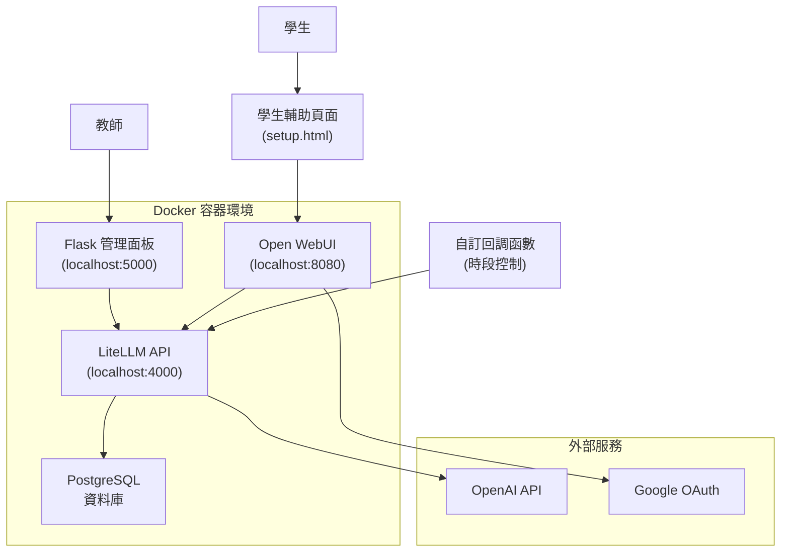
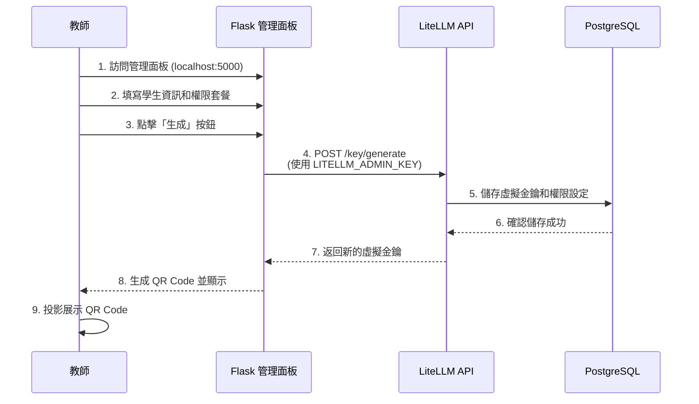
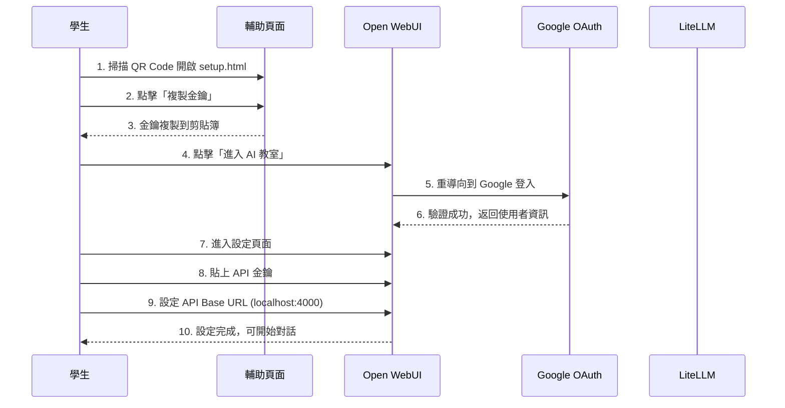
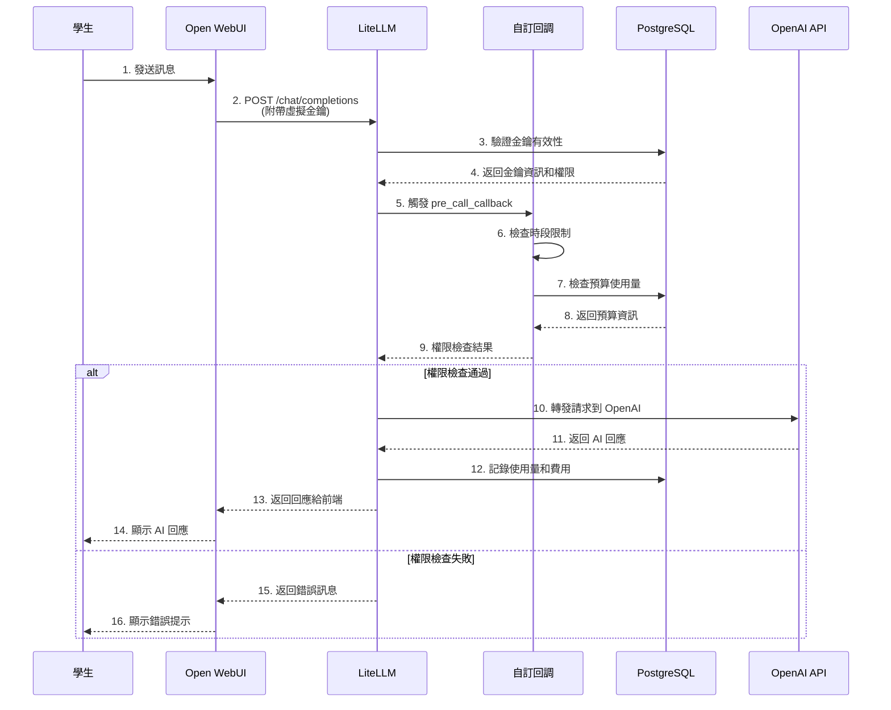
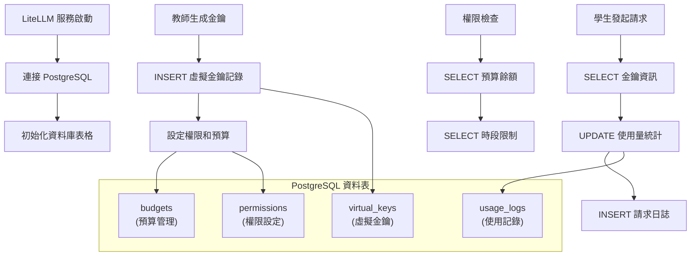

# 系統流程圖

本系統涉及兩個主要的角色流程：教師的管理流程和學生的使用流程。

## 系統架構流程圖

## 1. 教師管理流程（生成通行證）

## 2. 學生使用流程（登入並設定）

## 3. 學生 API 請求流程

## 4. 資料庫操作流程

## 重要特性說明

### 🔐 安全性
- **金鑰隔離**: 學生只能取得虛擬金鑰，真實的 OpenAI Key 完全隔離
- **權限控制**: 每個虛擬金鑰都有獨立的權限設定和預算限制
- **環境變數分離**: LiteLLM 使用獨立的 `.env.litellm` 檔案

### 📊 監控與控制
- **即時預算追蹤**: 每次 API 請求都會更新使用量到 PostgreSQL
- **時段控制**: 透過自訂回調函數實現上課時間限制
- **使用記錄**: 完整的請求日誌供教師查看和分析

### 🚀 效能與擴展性
- **PostgreSQL**: 支援高並發和複雜查詢
- **Docker 容器化**: 易於部署和擴展
- **微服務架構**: 各服務獨立運作，易於維護

### 📱 使用者體驗
- **QR Code**: 簡化學生設定流程
- **Google 登入**: 整合現有教育帳號系統
- **響應式介面**: 支援各種裝置存取