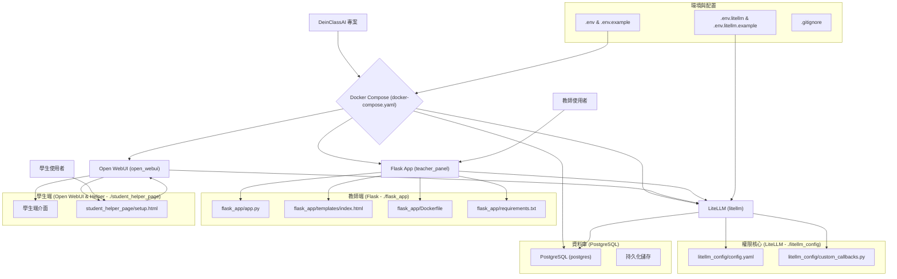

# 專案檔案架構

本專案採用 Monorepo 的形式組織，將不同服務的程式碼和設定檔放在同一個 Git 倉庫中，方便統一管理。專案使用 Docker Compose 進行微服務編排，包含教師管理面板、LiteLLM 權限核心、PostgreSQL 資料庫和學生前端介面。



## 專案檔案結構

```
DeinClassAI/
├── .env                          # 主要環境變數檔案 (不提交)
├── .env.example                  # 主要環境變數範本
├── .env.litellm                  # LiteLLM 專用環境變數 (不提交)
├── .env.litellm.example          # LiteLLM 環境變數範本
├── .gitignore                    # Git 忽略規則
├── docker-compose.yaml           # Docker 服務編排檔案
├── FLOW.md                       # 系統流程圖文檔
├── FRAMEWORK.md                  # 專案架構文檔
├── INIT.md                       # 專案初始化總結
├── README.md                     # 專案說明文檔
├── TODO.md                       # 專案任務列表
├── flask_app/                    # 教師管理面板
│   ├── Dockerfile               # Flask 應用容器化檔案
│   ├── app.py                   # Flask 後端主程式
│   ├── requirements.txt         # Python 依賴套件
│   └── templates/
│       └── index.html          # 教師管理介面
├── litellm_config/              # LiteLLM 權限核心配置
│   ├── config.yaml             # LiteLLM 服務配置
│   └── custom_callbacks.py     # 自訂回調函數 (時段控制)
└── student_helper_page/         # 學生輔助頁面
    └── setup.html              # 學生設定引導頁面
```

## 服務架構說明

### 1. PostgreSQL 資料庫 (postgres)
- **用途**: 儲存 LiteLLM 的使用者金鑰、預算記錄、使用統計等資料
- **特點**: 支援高並發、ACID 事務、豐富的查詢功能
- **持久化**: 使用 Docker Volume 確保資料不會因容器重啟而遺失
- **連接埠**: 5432 (可選擇性對外開放)

### 2. LiteLLM 權限核心 (litellm)
- **用途**: API 代理和權限管理中樞
- **功能**: 虛擬金鑰管理、預算控制、模型限制、時段控制
- **資料庫**: 連接到 PostgreSQL 進行資料持久化
- **環境變數**: 使用獨立的 `.env.litellm` 檔案，避免與其他服務衝突
- **連接埠**: 4000

### 3. Flask 教師管理面板 (teacher_panel)
- **用途**: 提供教師友善的 Web 介面
- **功能**: 生成學生通行證、管理權限套餐、監控使用狀況
- **依賴**: 需要 LiteLLM 服務先啟動
- **連接埠**: 5000

### 4. Open WebUI 學生前端 (open_webui)
- **用途**: 學生使用的 AI 對話介面
- **功能**: Google 登入、聊天介面、API 金鑰設定
- **認證**: 整合 Google OAuth 2.0 (OIDC)
- **連接埠**: 8080

## 環境變數管理

### 主要環境變數 (.env)
- `OPENAI_API_KEY`: OpenAI API 金鑰
- `LITELLM_ADMIN_KEY`: LiteLLM 主控金鑰
- `GOOGLE_CLIENT_ID`: Google OAuth 客戶端 ID
- `GOOGLE_CLIENT_SECRET`: Google OAuth 客戶端密鑰

### LiteLLM 專用環境變數 (.env.litellm)
- `LITELLM_MASTER_KEY`: LiteLLM 主控金鑰
- `UI_USERNAME` / `UI_PASSWORD`: LiteLLM UI 登入憑證
- `LITELLM_SALT_KEY`: 資料庫加密金鑰 (一旦設定不可更改)
- `DATABASE_URL`: PostgreSQL 連線字串

## 資料流向

1. **教師** → Flask App → LiteLLM API → PostgreSQL
2. **學生** → Open WebUI → LiteLLM Proxy → OpenAI API
3. **權限檢查** → Custom Callbacks → 時段/預算驗證
